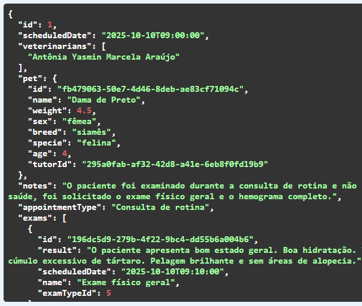
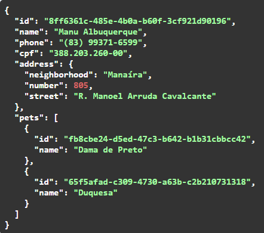
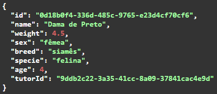
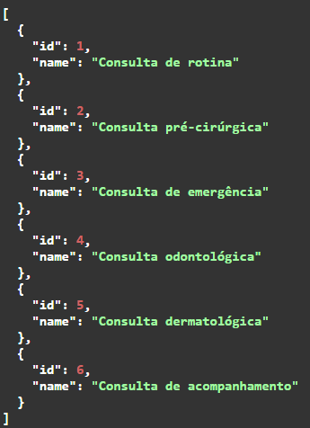
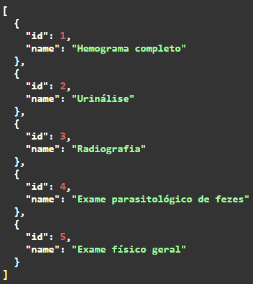
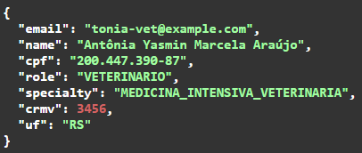
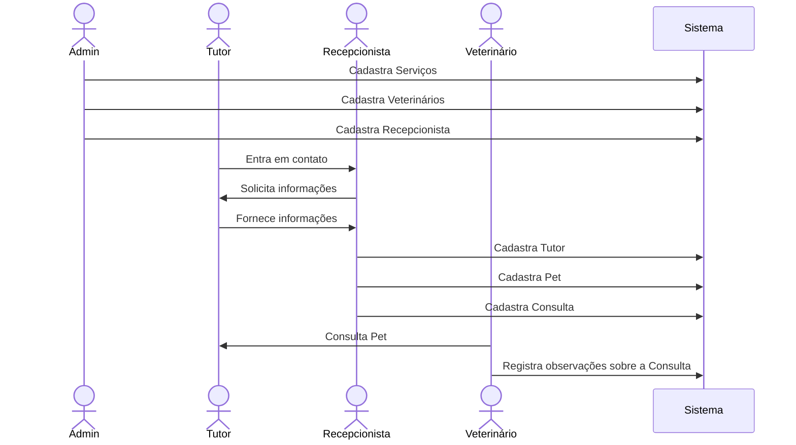
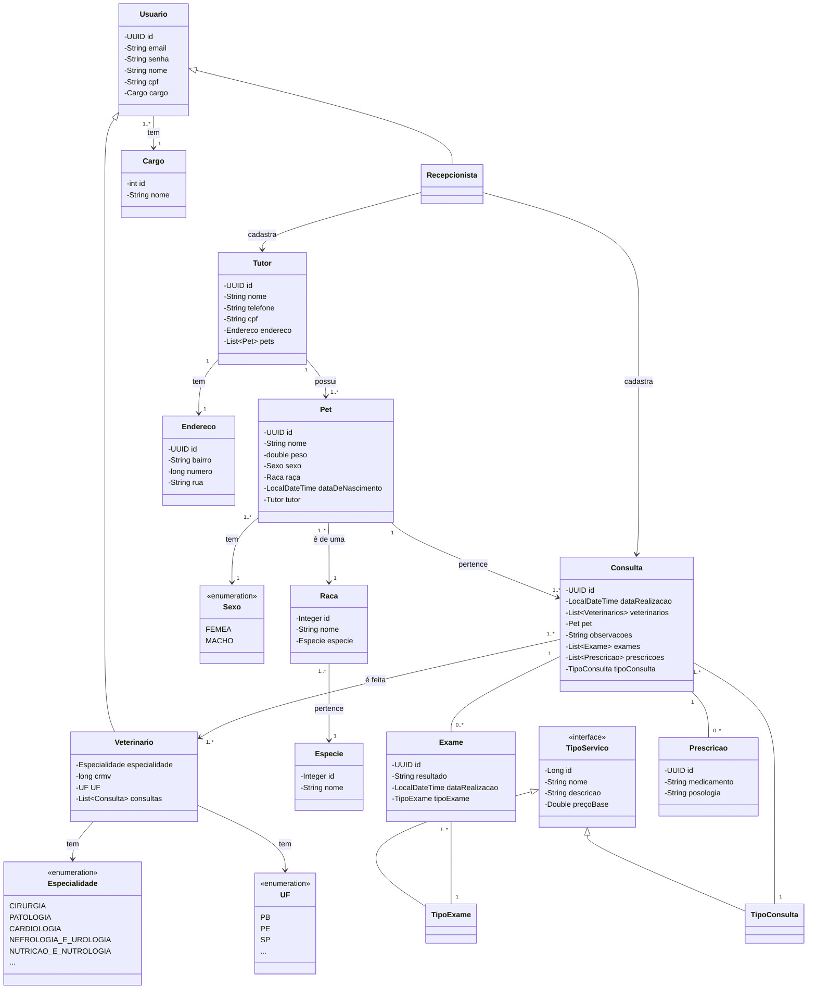
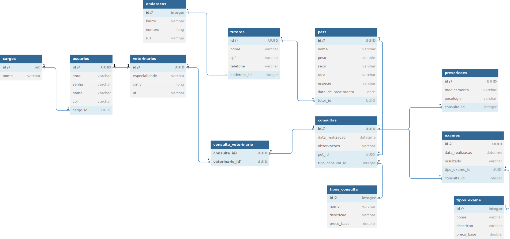

# 4Paws 🐾🐕‍🦺

O 4Paws é uma API projetada para otimizar e simplificar a gestão de clínicas veterinárias. Oferecendo um conjunto de ferramentas para donos de clínicas veterinários, recepcionistas e veterinários gerenciarem consultas, exames, prescrições, pets e seus respectivos tutores.

<details>
    <summary><b>Consultas</b></summary>
    
</details>

<details>
    <summary><b>Tutores</b></summary>
    
</details>

<details>
    <summary><b>Pets</b></summary>
    
</details>

<details>
    <summary><b>TiposDeConsulta</b></summary>
    
</details>

<details>
    <summary><b>TiposDeExame</b></summary>
    
</details>

<details>
    <summary><b>Profiles</b></summary>
    
</details>

## Documentação Swagger
[http://localhost:8080/swagger-ui/index.htm](http://localhost:8080/swagger-ui/index.html)

## Lista de Conteúdos

📌 [Funcionalidades](#funcionalidades)

📌 [Dados de Acesso (para testes)](#dados-de-acesso-para-testes)

📌 [Diagramas UML](#diagramas-uml)

📌 [Tecnologias Utilizadas](#tecnologias-utilizadas)

📌 [Licença](#licença)

📌 [Autor](#autor)

## Funcionalidades

1. **Gerenciamento de consultas:** 📅
   - Agendamento, atualização e cancelamento de consultas
   - Listagem de consultas para veterinários (ordenadas por data)
2. **Gerenciamento de pets:** 🐶🐱
   - Registro de novos pets
   - Atualização de informações dos pets
3. **Gerenciamento de exames:** 🔬
   - Registro, edição e remoção de exames
4. **Controle de prescrições:** 💊
   - Registro, edição e remoção de prescrições médicas
5. **Administração de tipos de serviços:** 📋
   - Cadastro e atualização de tipos de consultas e tipos de exames
   - Listagem de tipos de consultas e tipos de exames disponíveis
6. **Gerenciamento de usuários:** 👥
   - Registro de veterinários 👨‍⚕️👩‍⚕️, recepcionistas 💼 e administradores 🔑
   - Autenticação de usuários (login) 🔐
   - Visualização de perfil de usuário 👤
7. **Gerenciamento de tutores:** 🧑‍🤝‍🧑
   - Registro de novos tutores
   - Atualização de informações dos tutores
   - Busca de tutores por CPF 🔍

### Dados de Acesso (para testes)

###### admin
```json
{
   "email": "admin@example.com",
   "password": "123"
}
```

###### recepcionista
```json
{
   "email": "maria-recep@example.com",
   "password": "123"
}
```

###### veterinário
```json
{
   "email": "tonia-vet@example.com",
   "password": "123"
}
```

## Diagramas UML
### Diagrama de Sequência



### Diagrama de Caso de Uso


### Diagrama de Classes


### Diagrama de Banco de Dados


## Tecnologias Utilizadas

- Java
  - Spring Boot
  - Spring Data Jpa
  - Spring Security
  - Spring Validation
- JWT
- H2 Database
- Lombok

### Licença

[Apache License 2.0](https://github.com/EmmanuellaAlbuquerque/4Paws/blob/main/LICENSE)

### Autor

<a href="https://www.linkedin.com/in/emmanuella-albuquerque/">
  
</a>

Meu Linkedin: [in/emmanuella-albuquerque/](https://www.linkedin.com/in/emmanuella-albuquerque/)

Made with 💜☕ by <a href="https://www.linkedin.com/in/emmanuella-albuquerque/">Manu</a>
