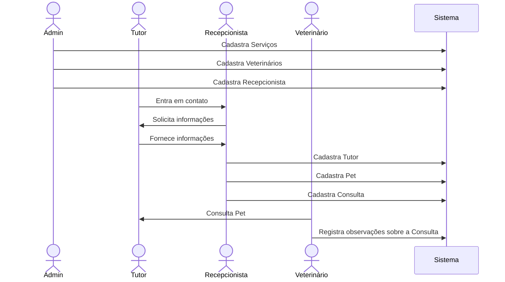

# 4Paws

## Diagramas UML
### Diagrama de Sequência

```mermaid
sequenceDiagram
    actor Admin
    actor Tutor
    actor Recepcionista
    actor Veterinário
    participant Sistema

    Admin ->> Sistema: Cadastra Serviços
    Admin ->> Sistema: Cadastra Veterinários
    Admin ->> Sistema: Cadastra Recepcionista
    Tutor ->> Recepcionista: Entra em contato
    Recepcionista ->> Tutor: Solicita informações
    Tutor ->> Recepcionista: Fornece informações
    Recepcionista ->> Sistema: Cadastra Tutor
    Recepcionista ->> Sistema: Cadastra Pet
    Recepcionista ->> Sistema: Cadastra Consulta

    Veterinário ->> Tutor: Consulta Pet
    Veterinário ->> Sistema: Registra observações sobre a Consulta
```

### Diagrama de Caso de Uso

