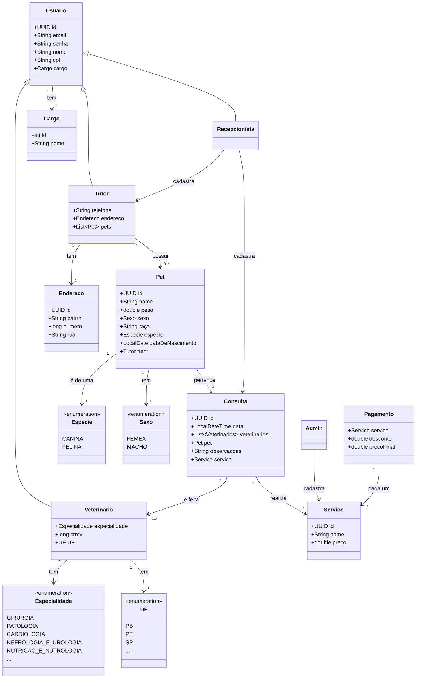

# 4Paws

O 4Paws é uma API projetada para otimizar e simplificar a gestão de clínicas veterinárias. Ela oferece um conjunto de ferramentas para gerenciar consultas, exames, prescrições, registros dos veterinários da clínica, registros de animais de estimação e informações dos tutores.

## Funcionalidades

1. **Gerenciamento de consultas:**
    - Agendamento, atualização e cancelamento de consultas
    - Listagem de consultas para veterinários (ordenadas por data)
2. **Gerenciamento de pets:**
    - Registro de novos pets
    - Atualização de informações dos pets
3. **Gerenciamento de exames:**
    - Registro, edição e remoção de exames
4. **Controle de prescrições:**
    - Registro, edição e remoção de prescrições médicas
5. **Administração de tipos de serviços:**
    - Cadastro e atualização de tipos de consultas e tipos de exames
    - Listagem de tipos de consultas e tipos de exames disponíveis
6. **Gerenciamento de usuários:**
    - Registro de veterinários, recepcionistas e administradores
    - Autenticação de usuários (login)
    - Visualização de perfil de usuário
7. **Gerenciamento de tutores:**
    - Registro de novos tutores
    - Atualização de informações dos tutores
    - Busca de tutores por CPF

## Diagramas UML
### Diagrama de Sequência

### Diagrama de Caso de Uso

### Diagrama de Classes

