# 4Paws 🐾🐕‍🦺

O 4Paws é uma API projetada para otimizar e simplificar a gestão de clínicas veterinárias. Ela oferece um conjunto de ferramentas para gerenciar consultas, exames, prescrições, registros dos veterinários da clínica, registros de animais de estimação e informações dos tutores.

## Lista de Conteúdos

📌 [Funcionalidades](#funcionalidades)

📌 [Dados de Acesso (para testes)](#dados-de-acesso-para-testes)

📌 [Diagramas UML](#diagramas-uml)

📌 [Tecnologias Utilizadas](#tecnologias-utilizadas)

📌 [Licença](#licença)

📌 [Autor](#autor)

## Funcionalidades

1. **Gerenciamento de consultas:** 📅
   - Agendamento, atualização e cancelamento de consultas
   - Listagem de consultas para veterinários (ordenadas por data)
2. **Gerenciamento de pets:** 🐶🐱
   - Registro de novos pets
   - Atualização de informações dos pets
3. **Gerenciamento de exames:** 🔬
   - Registro, edição e remoção de exames
4. **Controle de prescrições:** 💊
   - Registro, edição e remoção de prescrições médicas
5. **Administração de tipos de serviços:** 📋
   - Cadastro e atualização de tipos de consultas e tipos de exames
   - Listagem de tipos de consultas e tipos de exames disponíveis
6. **Gerenciamento de usuários:** 👥
   - Registro de veterinários 👨‍⚕️👩‍⚕️, recepcionistas 💼 e administradores 🔑
   - Autenticação de usuários (login) 🔐
   - Visualização de perfil de usuário 👤
7. **Gerenciamento de tutores:** 🧑‍🤝‍🧑
   - Registro de novos tutores
   - Atualização de informações dos tutores
   - Busca de tutores por CPF 🔍

### Dados de Acesso (para testes)

###### admin
```json
{
   "email": "admin@example.com",
   "password": "123"
}
```

###### recepcionista
```json
{
   "email": "maria-recep@example.com",
   "password": "123"
}
```

###### veterinário
```json
{
   "email": "tonia-vet@example.com",
   "password": "123"
}
```

## Diagramas UML
### Diagrama de Sequência

```mermaid
sequenceDiagram
    actor Admin
    actor Tutor
    actor Recepcionista
    actor Veterinário
    participant Sistema

    Admin ->> Sistema: Cadastra Serviços
    Admin ->> Sistema: Cadastra Veterinários
    Admin ->> Sistema: Cadastra Recepcionista
    Tutor ->> Recepcionista: Entra em contato
    Recepcionista ->> Tutor: Solicita informações
    Tutor ->> Recepcionista: Fornece informações
    Recepcionista ->> Sistema: Cadastra Tutor
    Recepcionista ->> Sistema: Cadastra Pet
    Recepcionista ->> Sistema: Cadastra Consulta

    Veterinário ->> Tutor: Consulta Pet
    Veterinário ->> Sistema: Registra observações sobre a Consulta
```



### Diagrama de Caso de Uso


### Diagrama de Classes


## Tecnologias Utilizadas

- Java
  - Spring Boot
  - Spring Data Jpa
  - Spring Security
  - Spring Validation
- JWT
- H2 Database
- Lombok

### Licença

[Apache License 2.0](https://github.com/EmmanuellaAlbuquerque/4Paws/blob/main/LICENSE)

### Autor

<a href="https://www.linkedin.com/in/emmanuella-albuquerque/">
  
</a>

Meu Linkedin: [in/emmanuella-albuquerque/](https://www.linkedin.com/in/emmanuella-albuquerque/)

Made with 💜☕ by <a href="https://www.linkedin.com/in/emmanuella-albuquerque/">Manu</a>
